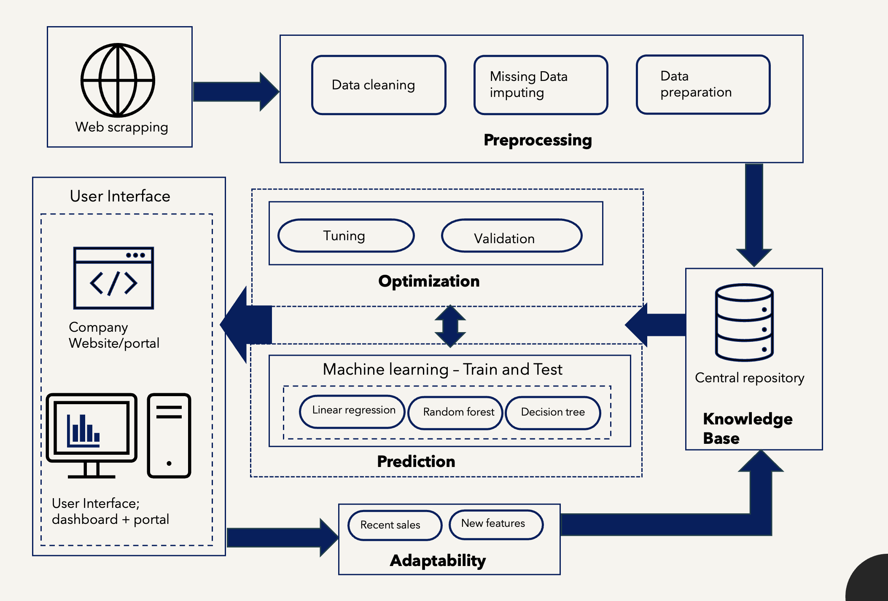

# Car Price Prediction Dashboard

This project aims to develop a machine learning model to predict the prices of used Toyota cars in California. By leveraging a Random Forest regression model, the solution provides accurate price predictions based on car model, year, and mileage. The project also includes an interactive dashboard for users to input car details and receive price predictions, along with a summary of the car inventory.

